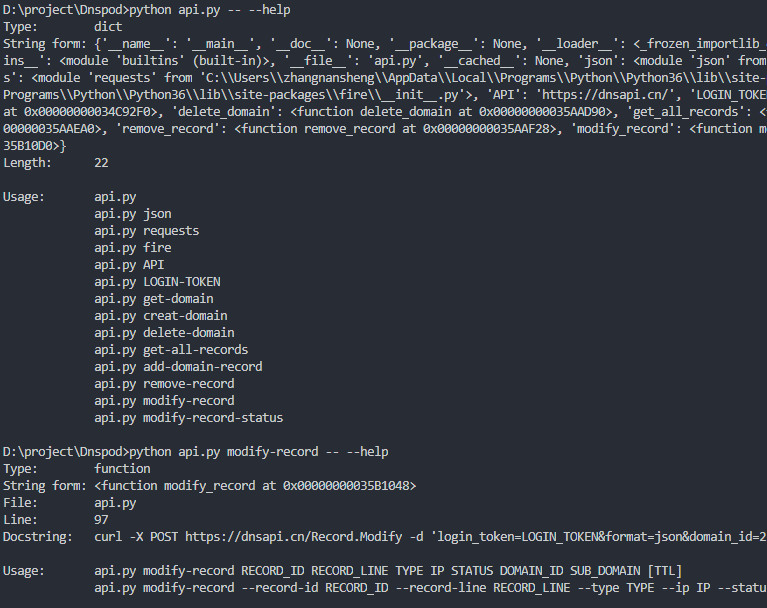
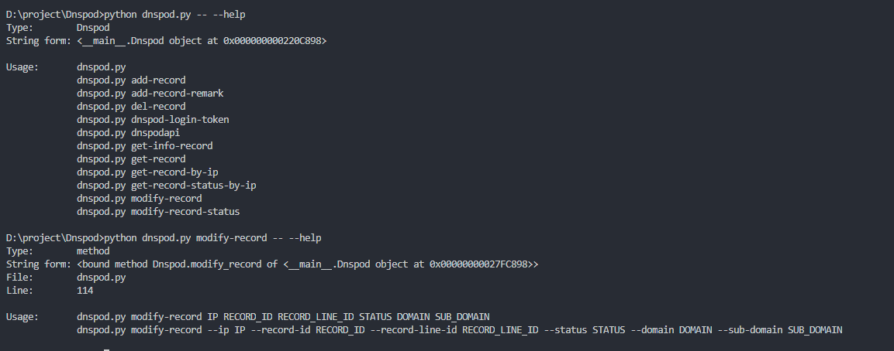

## Dnspod

腾讯云域名解析服务dnspod命令行工具

### 快速开始
在settting添加dnspod token，安装库`pip install -r requirements`

### 使用帮助

### 常见使用
#### 获取dnspod所有域名
`# python api.py get-damain`

#### 获取某域名的所有记录
`# python api.py get-all-records DOMAIN`

#### 获取某域名的子域名所有记录信息
`# python dnspod.py get-info-record DOMAIN SUB_DOMAIN`

#### 通过IP查看某条记录的状态
`# python dnspod.py get-record-status-by-ip IP DOMAIN SUB_DOMAIN`

#### 添加域名记录
`# python dnspod.py add-record IP RECORD_LINE STATUS DOMAIN SUB_DOMAIN`

#### 修改域名记录
`# python dnspod.py modify-record IP RECORD_LINE_ID STATUS DOMAIN SUB_DOMAIN`

#### 修改域名记录状态
`# python dnspod.py modify-record-status DOMAIN SUB_DOMAIN IP STATUS`

#### 删除域名记录
`# python dnspod.py del-record IP DOMAIN SUB_DOMAIN`